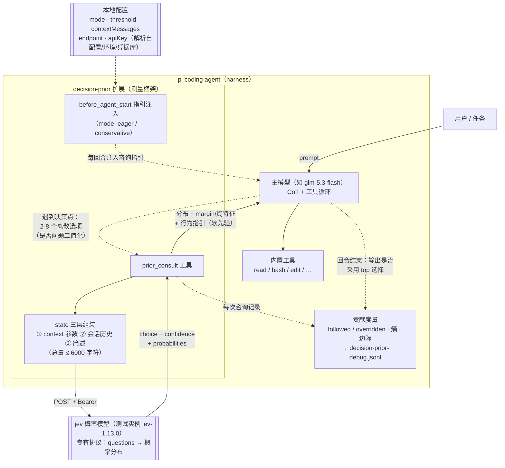

# 在 CoT 中引入高效判断模型能否加速 AI Coding Harness？——以 jev 为实例的设计与讨论

> 最近jev比较热门，我试着把 jev 这个高效判断模型接进 pi 的 CoT，看能不能让 coding harness 提速——结果是机制跑通了，决策质量也有收益，但我的测试里它既没有变快，推理消耗也没有比关闭 jev 时更少。

[](README.md) [](README_EN.md)

*A Probabilistic-Prior Decision Assistant for Coding Agents: Design and Empirical Study*

> 版本 0.4 · 实验环境：pi 编码代理 + glm-5.3-flash（某商业中转的受限通道，身份略）+ jev-1.13.0（专有协议，细节略）
> 数据来自本仓库 `benchmark.py` 与 debug 日志的真实运行记录；核心对比为 3 次独立重复（mean ± stdev），部分为单次运行。
> **研究对象与实例**：jev-1.13.0 是本文的研究对象，也是唯一测试过的先验实例（经某商业中转的受限通道接入）。测量框架（pi-decision-prior）刻意做成模型无关，但本文的全部结论仅关于 jev；结果表中的 jev=off/on 均指该实例的开关状态。**本文是一篇讨论稿，而非定论性的实验研究**：LLM API 无真正的 seed，结果受采样随机性、网络波动与服务端负载影响，结论应以量级与方向为准，而非精确数值。

---

## 摘要

编码代理（coding agent）在执行任务时需要在大量离散选项间做决策：技术选型、根因假设、需求消解、修复策略。这些决策目前完全由主模型的链式推理（CoT）承担，其成本随回合数与上下文重处理线性增长。本文检验的假设是：**在 CoT 中引入一个更高效的判断模型——在主模型付出完整推理成本之前，以概率分布的形式给出选项级判断——可以加速 coding harness**。为检验它，本文实现测量框架 **pi-decision-prior**（一个 pi 扩展）：它把外部的概率模型 jev 接入代理的决策回路——主模型在离散选项间行动前调用 `prior_consult`，获得各选项的概率分布，并以此作为先验与自身分析融合。

我们通过四组测试讨论该机制：（1）四类决策形态的定性场景；（2）短任务的 A/B 消耗对比（3 次重复）；（3）thinking 档位与先验的组合；（4）多文件长链路排查任务。主要发现：**加速假设在测试范围内不成立**（所有先验开启的运行 wall 时间一致更长），但**先验对推理的替代在功能上成立、在消耗上不成立**（on/high→on/low 时 thinking −45%；但 on/low 总量 1090 仍高于 off 基线的 971）；在 3 次重复中，短任务的消耗净增加是稳健的（ambiguous 任务 wall +45s，长链路任务 +22s），而单次运行中观察到的“输入 token 减半”在重复下方差过大、未能复现；先验在歧义任务上产生了可观测的质量收益（分裂分布促使模型对冲实现）；其最稳定的价值形态是**修复策略仲裁**——在多种修法均可行的节点提供有依据、可审计的选择。我们进一步给出该机制的成本经济学边界：仅当基线会因错误方向浪费多个工具回合时，decisive 先验才能回本。

---

## 1 引言

### 1.1 动机

LLM 代理的决策质量与其推理消耗之间存在张力。面对"用 A 还是 B"这类离散选择，主模型通常以 CoT 枚举候选、逐个权衡——这既消耗输出 token，也拉长回合链路。与此同时，一个小型专用模型若能对"给定问题与候选集"直接输出概率分布，就有可能以一次廉价调用替代主模型的整段权衡过程。

jev 即是这样一种概率模型：给定问题与离散选项，返回各选项的概率、最高概率选项及置信度。本文不训练 jev，而是围绕研究问题讨论**接入方式与实际效果**：它应挂在代理回路的哪个位置？上下文给多少？返回的概率应以何种策略对待（硬门控还是软先验）？它到底能不能省钱？

这些问题背后是本文要检验的加速假设：**harness 的耗时主要由主模型的权衡推理与回合链路构成；若在 CoT 中插入一个更高效的判断模型，让它在主模型付出完整推理成本之前给出选项级判断，harness 有望被加速。**下文的设计与数据都围绕该假设展开。

### 1.2 与相近概念的辨析

jev 的角色容易与 rerank 模型混淆，故先做界定。两者形式同构——输入（问题 + 候选集）、输出（候选分数）——但有三点本质差异：

| | Rerank 模型 | pi-decision-prior 中的 jev |
|---|---|---|
| 打分对象 | 检索文档的相关性 | 决策选项的优劣 |
| 输出作用 | **直接决定**进入上下文的内容 | 先验，主模型可推翻 |
| 失败模式 | 排错序污染上下文 | 建议错误，主模型有自己的分析可对冲 |

更准确的类比是 LLM-as-a-judge 或 RLHF 中的 reward model：对候选**动作**打分。区分的意义在于评估方式——rerank 用 NDCG，而本系统用"主模型跟随率"（§3.4）。

---

## 2 系统设计

### 2.1 接入位置

pi-decision-prior 是 pi 的 TypeScript 扩展，注册一个 LLM 可调用工具 `prior_consult(question, options, state?, context?)`，并做三件配套的事：

1. **激活管理**：开启时工具进入活动工具列表，关闭时移出（`setActiveTools`）；
2. **提示注入**：开启期间通过 `before_agent_start` 注入使用指引（按策略模式区分措辞，见 §2.4）；
3. **结果仲裁**：工具返回分布 + 分布形态特征 + 行为指引文本，进入主模型上下文。

### 2.1.1 运行结构图



图 1：jev 在 harness 决策回路中的接入位置与数据流。实线为咨询路径，虚线为配置/度量路径。

### 2.2 上下文构成：三层 state

先验质量取决于 jev 看到什么。`state` 字段由扩展自动组装三层：

1. **决策特定事实**：主模型经可选 `context` 参数传入（约束、代码情况、用户偏好）；
2. **自动会话历史**：最近 `contextMessages` 条（默认 6）用户/助手消息；
3. **主模型的简述**（`state` 参数）。

总量上限 6000 字符。实测该参数化有效：在配置选型任务中，主模型主动传入 "tomllib 为 3.11+ 标准库、TOML 是 pyproject 惯例、YAML 需第三方依赖" 等事实后，jev 置信度从基线的摇摆（§5.1 场景 4a）升至 1.0。

### 2.3 待遇策略：从硬阈值到分布驱动

初版实现含低置信度硬门控（top 置信度 < 0.6 时强制主模型向用户呈现备选）。v0.3 起改为**分布驱动**：阈值默认 0（可配置恢复），工具输出改为刻画分布形状——margin < 0.2 或归一化熵 > 0.8 时标注 "no strong opinion"，由主模型按决策的利害程度自行决定谨慎程度。理由：阈值是上下文盲的——0.39 的置信度在"变量命名"时无所谓，在"删库"时该停；利害判断应由拥有全部上下文的主模型做出，而非静态数字。设计该问时咨询 jev 自身，"完全移除"获 0.68，与直觉一致。

### 2.4 咨询策略与是否型问题

`mode` 两档：`conservative`（仅真实决策点）与 `eager`（任何判断性分歧默认咨询，含二值化的是否问题）。是否型问题统一框架为两选项（如 `["yes", "no"]`）。eager 含逃生舱："分布明显不会改变行动时可跳过"——实测该条款有效阻止了对有明确惯例的琐碎决策（如 PEP 8 缩进）的无效咨询。

### 2.5 贡献度量（debug 模式）

开启 debug 后每次咨询：(a) 在会话中渲染概率条形图记录；(b) 回合结束时做**跟随判定**——主模型输出/工具调用是否采用了 jev 的 top 选择（followed / overridden / 未判定）；(c) 记录追加至 JSONL 供事后审计，保存实际发送的完整 state。聚合统计含跟随率、平均置信度、平均归一化熵、decisive 占比（margin ≥ 0.4）、token 开销与延迟。

---

## 3 测试方法

### 3.1 A/B 基准协议

`benchmark.py`：对同一任务（相同 fixture、相同 prompt），在 jev 关/开两种配置下各运行全新 `pi -p` 会话；统计 wall 时间、会话级 token 用量（解析会话 JSONL 中 assistant 消息的 usage）、咨询次数（debug 日志增量）；运行后恢复原配置。fixture 均植入可机械验证的正确性判据（如“修复后输出必须恰好 10 条”）。

**重复与“seed”语义**：LLM API 不提供真正的采样 seed，`--runs 3` 指的是在同一条件下做 3 次独立重复（每次全新会话与 fixture 目录），报告 mean ± stdev。重复间的差异来源包括采样随机性、网络波动、服务端负载与模型的读取策略选择，无法也不必相互分离。

### 3.2 任务套件

| 任务 | 类型 | fixture 要点 |
|------|------|--------------|
| debug-bug | 并发 bug 修复 | 多线程丢条目，多假设可循 |
| ambiguous-optimize | 歧义需求 | "优化输出"有 ≥4 种合理解读 |
| multi-file-debug | 多文件排查（v1） | 8 模块，聚合层 dict key 覆盖，读代码可定位 |
| long-explore | 长链路排查（v2） | 12 模块，汇率表键尾随空格 → join miss → 静默丢弃，必须交叉核对数据 |

### 3.3 指标

wall 时间、输入/输出 token、回合数、工具调用数、thinking 字符量、咨询次数、修复正确性（机械验证）、跟随判定。

### 3.4 有效性威胁与定位声明

**定位声明：本文是一次工程讨论（engineering discussion），不是受控科学实验。** 具体威胁包括：

- **网络与服务端波动**：wall 时间受 API 延迟、限流、上游负载影响，可能远大于条件间的真实差异；个别运行出现异常值（如一个 jev=off 重复直接作答未用工具，输入仅 3.7k；一个 jev=on 重复因多轮重试输入达 57k），对均值影响显著；
- **采样随机性**：LLM 无 seed，同一条件的两次运行可能选择不同的读取策略；
- **混杂变量**：输入 token 的增减可能与模型读取风格（批量 dump vs 选择性精读）混杂而非 jev 所致；
- **样本量**：n=3 仅能观察量级与方向，不足以上下置信区间；单模型、单 jev 版本。

因此所有结论以“量级 + 方向 + 机制解释”的形式给出，精确数值仅供参考。

---

## 4 结果

### 4.1 决策形态的定性场景

**场景一（decisive 先验替代探索）**：并发丢数据 bug，主模型列出 4 个根因假设咨询 jev，"线程内异常被吞"获 1.0，直接定向修复，一轮完成。先验吃掉了 CoT 中"逐假设试探"的探索段。

**场景二（分裂分布驱动不确定性呈现）**："优化输出"这类歧义需求，jev 返回 0.50/0.34/0.14/0.02（margin 0.16，熵 0.77）。主模型采用 top 方案但明确报告分布分散并列出备选。此处 jev 的价值不是给答案，而是揭示"需求本身歧义大"。

**场景三（逃生舱）**："Python 用什么缩进"在 eager 下**未**触发咨询——PEP 8 有定论，模型引用逃生舱条款直接作答。

**场景四（是否型 + 上下文接地）**："全局装包是不是坏实践"被主模型扩展为三选项框架，jev 给"视情况"0.39，模型输出条件性结论（"全局装工具、本地装依赖"）而非武断站队；配置选型任务中主模型传入决策事实后，jev 置信度达 1.0，咨询输入 token 从约 400 升至 519。

各场景中 jev 实际返回的概率分布：


### 4.2 短任务 A/B 消耗（n=3）

ambiguous-optimize 任务 3 次独立重复（debug-bug 为单次运行，见括号）：

| 任务 | 配置 | 耗时 | 输入 tok | 输出 tok | 咨询 |
|------|------|------|----------|----------|------|
| ambiguous-optimize | off | 40.7 ± 2.8s | 11079 ± 6419 | 984 ± 293 | 0 |
| ambiguous-optimize | on | 86.0 ± 24.6s | 28047 ± 25170 | 1615 ± 657 | 1 |
| debug-bug（单次） | off | 77.4s | 20492 | 1502 | 0 |
| debug-bug（单次） | on | 98.8s | 19136 | 1659 | 1 |

3 次重复中 jev=on 全部恰好咨询 1 次，wall 开销 +45s 是方向性稳健的；但 token 方差极大（off 的一个重复直接作答未用工具，输入仅 3.7k；on 的一个重复因多轮工具重试输入达 57k），均值±标准差在此样本量下只能作量级参考。


定性差异比数字更有信息量：debug-bug 两路径质量相当；ambiguous-optimize 上，off 路径押注单一解读，on 路径因 jev 给出接近对半的分布（结构化报告 0.49 / 保留逐行数字 0.47）而**同时实现两种输出格式**（`--report`/`--json`/`--quiet`），是可观测的质量收益。

### 4.3 thinking 档位组合

ambiguous-optimize 任务的推理侧测量：

| 配置 | 耗时 | 回合 | 输入 tok | 输出 tok | thinking 字符 |
|------|------|------|----------|----------|----------------|
| off / high | 37.4s | 4 | 15441 | 873 | 971 |
| on / high | 98.3s | 7 | 29415 | 2089 | 1999 |
| on / low | 81.0s | 6 | 30746 | 1626 | 1090 |

先验在手时降档 thinking：thinking 字符 −45%（1999→1090）、输出 −22%，质量未塌（咨询置信度 0.98）。**但总消耗仍高于 off/high 基线**：省下的推理量被咨询回合与每回合的上下文重处理吞没。在短任务上，thinking 只占几百字符，不是成本大头。且相对 off/high 基线，on/low 的总 thinking（1090）仍高于 971——先验没有把 thinking 消耗压到基线之下。


### 4.4 长链路探索

单次运行的初步观察：multi-file-debug（8 模块）两个配置都快速定位（off 5 回合 35s；on 7 回合 62s，jev 对根因假设给出 1.0 decisive）——任务太小，并行读完全部文件即可“过快消解”，先验没有节省空间。

long-explore（12 模块，根因为汇率表键尾随空格 → join miss → 静默丢弃，必须交叉核对数据）3 次独立重复：

| 配置 | 耗时 | 输入 tok | 输出 tok | 咨询 | 正确性 |
|------|------|----------|----------|------|--------|
| jev=off | 44.0 ± 5.2s | 16634 ± 2764 | 1119 ± 229 | 0 | 3/3 ✓ |
| jev=on | 66.1 ± 8.1s | 20180 ± 7392 | 1365 ± 310 | 1 | 3/3 ✓ |

两个结论：(1) **wall 开销 +22s 在重复下方向稳健**（三次 on 均慢于 off 均值），jev 在该任务上仍净增成本；(2) 单次运行中“on 路径输入 token 减半”（16311 vs 30003）**未能复现**——重复后 off 16634±2764 与 on 20180±7392 区间大幅重叠，该信号属于单次运行的读取风格方差，不能归因于 jev。这是重复测试带来自我修正的一例。

单次运行中的机制观察仍然成立：jev 的贡献形态自然迁移到了**修复策略仲裁**——主模型自行 diff 数据完成诊断后，就“只改代码 / 只改数据 / 都改”咨询 jev（0.65 / 0.22 / 0.13），采纳代码侧规范化——与 fixture 中“上游已确认完整”的约束一致，并在回答中显式引用 p≈0.65。

---

## 5 讨论

### 5.1 先验替代 CoT 的边界

观察支持一个分层结论：jev 替代的是 CoT 中**发散的枚举-打分段**（amortized deliberation），替代不了框架构建（列出正确的选项集仍需主模型的理解力）、利害推理（分布不含代价结构）与解释生成（分布是结论不是论证）。§4.3 显示：jev 开启时降 thinking 档位确实压缩推理（−45%），但 on/low 的总量（1090）仍高于 off 基线（971）——**功能被替代，消耗未降低**；再被 agentic 循环的固定开销掩盖——**在短任务上，决策先验是质量工具，不是省钱工具**。

### 5.2 成本经济学与加速判据

每次咨询的固定成本约为一个工具回合（数百 token + 1-2s 延迟 + 下一回合的上下文重处理，约 1.5-5k 输入 token）。回本条件：先验至少省下一个本会浪费的回合。这要求（a）任务探索空间足够大，（b）基线真的会走弯路。测试 4.4 中基线足够聪明（批量 dump + 并行读），未浪费回合，jev 因此净亏损 wall 时间。反过来，debug-bug 上 on 路径输入更低（19136 vs 20492）是"先验减少试错"的首个正信号。

把观察整理成加速判据：设一次咨询的固定开销为 C（本系统约 1.5-5k 输入 token + 1-2s + 一个回合的往返延迟），先验避免的试错回合数为 k，每回合的重处理成本为 R（本 fixture 中约 1.5-5k token、数秒），则**加速当且仅当 k·R > C**。长链路测试中 k=0（基线没走弯路），减速是必然的；加速只可能出现在 k≥1 的探索场景。压缩 C 与 R 各有路径：R 的推理分量可由先验 + thinking 降档消化（实测 −45%）；C 可通过更短的 state、更少的上下文层、或把多个决策合并为一次多选题咨询来降低。

### 5.3 分布驱动的价值形态

长链路测试中 jev 最稳定的价值不是"告诉答案"，而是**仲裁**：在诊断完成、多种修法均可行时，一次 0.65/0.22/0.13 的分布把主观取舍变成有依据、可审计的选择（决策与概率同留 debug 记录）。同理，场景二中分裂分布的价值在于促使模型对冲实现。这提示评估该类系统应以"决策记录的可审计性 + 跟随率"为核心指标，而非单纯的正确率。

### 5.4 归因的困难与重复测试的必要性

单次运行中 long-explore 出现过“on 路径输入减半”的强信号，曾被视为“先验减少上下文重处理”的证据；但 3 次重复后该信号未能复现（off 16634±2764 vs on 20180±7392，区间重叠），说明它属于读取风格方差。这一自我修正正是重复实验的价值：**在没有重复的情况下，单次运行的任何 token 对比都可能只是策略方差的投影**。这些都是本文未能顾及的变量，留给有兴趣的后续研究者。

---

## 6 局限

1. **统计效力**：核心对比 n=3（均值±标准差），仅能支持量级与方向的判断；网络波动与服务端负载导致个别运行的极端异常值（输入 3.7k 与 57k），均值对此敏感；wall 时间与 token 不同步（更快的运行可能消耗更多 token）。
2. **单模型**：主模型仅 glm-5.3-flash；jev 仅 jev-1.13.0。先验质量与主模型能力的交互未测。
3. **fixture 规模**：12 模块对人已是"小项目"，对现代模型仍是一次并行读取可消解的规模；真正长链路的结论外推有限。
4. **跟随判定的启发式**：以文本匹配判断 followed/overridden，存在误判可能（如选项词恰好出现在无关语境）。

## 7 结论：这只是一次尝试

本文记录的是一次**尝试**：在 pi coding agent 这类 harness 中，用 jev 代替编码代理 CoT 中的一部分——具体说是"枚举候选并打分"的那一段。对加速假设的直接回答是：**测试范围内未观测到加速**——所有先验开启的运行 wall 一致更长；被证实的是推理侧压缩与决策质量收益，且加速判据（k·R > C，见 §5.2）已被定位但未触发。机制是可行且可度量的，但收益形态比预期克制：推理功能被替代但消耗未降（on/low 总 thinking 1090 vs off 基线 971），短任务上总消耗净增加，最稳定的价值是修复策略仲裁与决策留痕。

需要坦率说明的是，本测试较为简单：fixture 只有 8-12 个模块、n=3、单模型、单 jev 版本，而真实世界中的变量远未顾及——模型的读取策略、网络与服务端波动、任务领域、主模型能力与先验质量的耦合、不同编程语言与工作流，都可能改变这里的结论（§3.4、§6 已列出我们意识到的一部分）。文中所有数字应被视为一次有记录的工程实践，而非可外推的科学结论。

因此，与其把本文读作一项定论性的研究，不如把它视作一场**讨论**的开端：一次尝试、几组观察，以及它们引出的问题。上面提到的每一个方向——更大规模的代码库、上下文层消融、先验校准曲线、自适应策略、把"策略仲裁"做成 diff 就绪后的强制检查点——都值得用更严格的设置重新检验，也欢迎有兴趣的同志带着自己的观察和数据继续这场讨论。

---

## 附录 A：使用与复现

### A.1 安装

`~/.pi/agent/settings.json` 加入 `"extensions": ["C:/Users/Administrator/Documents/pi-pi-decision-prior"]`，或复制本目录至 `~/.pi/agent/extensions/`，`/reload` 生效。

API key 解析顺序：显式配置 → `JEV_API_KEY` 环境变量 → 本地凭据库。

### A.2 命令

| 命令 | 说明 |
|------|------|
| `/prior` | 开/关（持久化） |
| `/prior ask "问题" \| 选项1 \| 选项2` | 手动咨询并注入上下文 |
| `/prior debug` / `debug log` / `debug summary` | 贡献度量 |
| `/prior set mode eager\|conservative` | 咨询策略 |
| `/prior set threshold <0-1>` | 0=分布驱动（默认），正数=硬门控 |
| `/prior set model\|endpoint\|maxOptions\|contextMessages\|providerId\|apiKey <v>` | 其余配置 |
| `/prior status` / `/prior test` / `/prior reset-stats` | 状态 / 连通性 / 清零 |

### A.3 复现

```bash
python benchmark.py                 # 全套 A/B（2 短任务 × 2 配置）
python benchmark.py --task long-explore   # 长链路任务
python benchmark.py --quick         # 单任务
```

协议探测路径备忘：**此处刻意略去**——封闭协议的端点与字段结构不随开源版本发布；探测方法（以错误信息为线索逐步逼近合法请求形状）本身是通用技巧，具体记录保留在私有副本中。源码：`index.ts`（入口）、`src/prior-client.ts`（协议）、`src/config.ts`（配置）、`src/stats.ts`（度量）、`benchmark.py`（基准）、charts.py（图表，输出于 assets/）。

### A.4 开源说明

本文将其视为一次讨论而非使用指南。