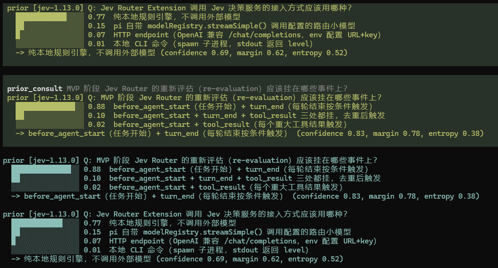
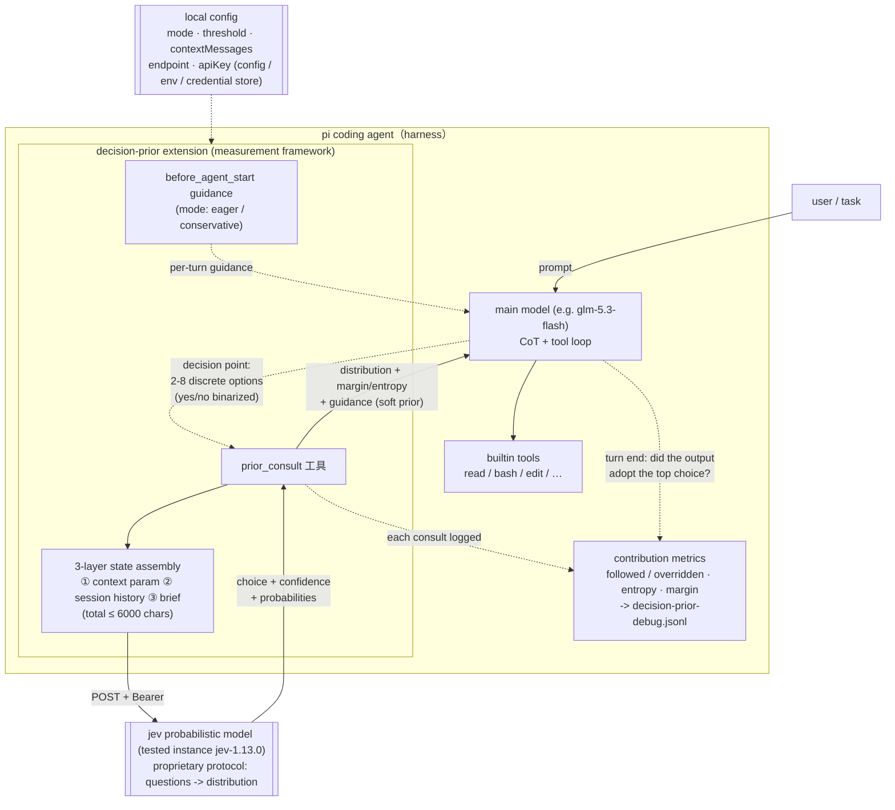
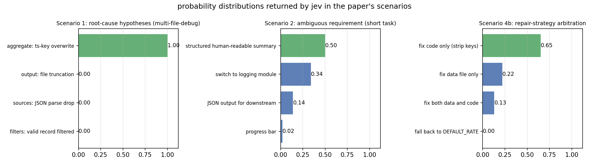
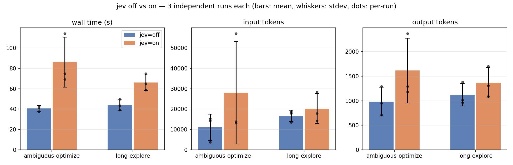
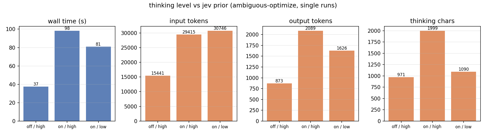

# Can a More Efficient Judgment Model inside CoT Accelerate an AI Coding Harness? — Design and Discussion around the jev Instance

> **TL;DR**: I tried plugging jev, a more efficient judgment model, into the CoT of pi to see if it would speed up the harness — the mechanism works and decision-quality gains are real, but in my tests it didn't get faster, and reasoning consumption was not lower than with jev off.

### Runtime Demo



A live pi session: every `prior_consult` call renders probability bars, the top choice and confidence / margin / entropy in the transcript, and is kept as an auditable decision record.

[](README.md) [](README_EN.md)

*面向编码代理的概率先验决策辅助：设计与实证*（Chinese version: [README.md](README.md)）

> Version 0.4 · Environment: pi coding agent + glm-5.3-flash (gated channel of a commercial relay, identity omitted) + jev-1.13.0 (proprietary protocol, details omitted)
> Data comes from real runs recorded by `benchmark.py` and the debug log; core comparisons use 3 independent repeats (mean ± stdev), some results are single runs.
> **Subject and instance**: jev-1.13.0 is the research subject of this paper and the only prior instance tested (reached via a gated channel of a commercial relay). The measurement framework (pi-decision-prior) is deliberately model-agnostic, but every conclusion here is about jev; jev=off/on in the result tables refers to that instance's toggle state. **this document is a discussion piece rather than a definitive experimental study**: LLM APIs expose no true sampling seed, and results are affected by sampling randomness, network fluctuations, and server-side load — read the conclusions as orders of magnitude and directions, not exact numbers.

---

## Abstract

Coding agents make many discrete decisions during task execution: technology choices, root-cause hypotheses, requirement disambiguation, repair strategies. Today these decisions are carried entirely by the main model's chain-of-thought (CoT), whose cost grows linearly with turn count and per-turn context reprocessing. This paper tests the hypothesis that **introducing a more efficient judgment model into the CoT — one that delivers option-level judgments as a probability distribution before the main model pays the full reasoning cost — can accelerate a coding harness**. To test it, this paper implements the measurement framework **pi-decision-prior** (a pi extension) that plugs jev into the agent's decision loop: before acting among discrete options, the main model calls `prior_consult`, receives a probability distribution over the options, and fuses it as a prior with its own analysis.

We discuss the mechanism through four test groups: (1) qualitative scenarios across four decision shapes; (2) A/B consumption comparison on short tasks (3 repeats); (3) combining the prior with reduced thinking levels; (4) multi-file long-chain investigation tasks. Main findings: **the acceleration hypothesis does not hold within the tested scope** — every prior-enabled run was slower in wall time — but **prior substitution holds functionally, not in consumption** (on/high→on/low, −45%; yet on/low totals 1090 chars, still above the off baseline's 971); across 3-run repeats, the net consumption *increase* on short tasks is directionally robust (ambiguous task: +45s wall; long-chain task: +22s), while the "input tokens halved" signal observed in single runs showed variance too large to replicate; the prior yields an observable quality gain on ambiguous tasks (a split distribution caused the model to hedge by implementing both candidate designs); and its most stable value form is **repair-strategy arbitration**: an evidence-backed, auditable choice among several viable fixes. We characterize the cost economics: a decisive prior pays for itself only when the baseline would waste multiple tool turns on wrong directions.

---

## 1 Introduction

### 1.1 Motivation

LLM agents face a tension between decision quality and reasoning cost. Faced with "A or B" style discrete choices, the main model enumerates candidates and weighs them via CoT — burning output tokens and lengthening the turn chain. Meanwhile, a small dedicated model that directly outputs a probability distribution over "a question plus a candidate set" could replace that entire weighing process with one cheap call.

jev is such a probabilistic model: given a question and discrete options, it returns per-option probabilities, the top choice, and a confidence score. This paper does not train jev; around that research question it discusses **how to integrate it and what it actually delivers**: where in the agent loop it should hang, how much context it needs, whether returned probabilities should be treated as a hard gate or a soft prior, and whether it saves anything. Behind these questions lies the acceleration hypothesis this paper tests: **the harness's wall time is dominated by the main model's weighing reasoning and its turn chain; if a more efficient judgment model is inserted into the CoT to deliver option-level judgments before the main model pays the full reasoning cost, the harness should speed up.** The design and data below all serve that hypothesis.

### 1.2 Positioning Relative to Related Concepts

jev's role is easily confused with a rerank model, so we delineate first. The two are structurally isomorphic — input (question + candidates), output (candidate scores) — but differ in three essentials:

| | Rerank model | jev in pi-decision-prior |
|---|---|---|
| Scored object | Relevance of retrieved documents | Quality of decision options |
| Role of output | **Directly determines** what enters context | Prior; the main model may override |
| Failure mode | Misranked order pollutes context | Bad advice, offset by the model's own analysis |

The closer analogy is LLM-as-a-judge or a reward model in RLHF: scoring candidate **actions**. The distinction matters for evaluation — rerank uses NDCG, whereas this system should be measured by *followed rate* (§2.5).

---

## 2 System Design

### 2.1 Integration Point

pi-decision-prior is a TypeScript extension for pi. It registers an LLM-callable tool `prior_consult(question, options, state?, context?)` and does three supporting things:

1. **Activation management**: when enabled, the tool joins the active tool set; when disabled, it is removed (`setActiveTools`);
2. **Prompt injection**: while enabled, usage guidance is injected via `before_agent_start` (wording varies by policy mode, §2.4);
3. **Result framing**: the tool returns the distribution plus shape features (margin, entropy) and guidance text into the main model's context.

### 2.1.1 Runtime Structure



Figure 1: where jev attaches in the harness decision loop and the data flow. Solid edges = consultation path; dashed = config / measurement.

### 2.2 Context Composition: Three-Layer State

Prior quality depends on what jev sees. The `state` field is assembled automatically from three layers:

1. **Decision-specific facts**: passed by the main model via the optional `context` parameter (constraints, code findings, user preferences);
2. **Automatic session history**: the last `contextMessages` (default 6) user/assistant messages;
3. **The main model's brief** (`state` parameter).

Total capped at 6000 characters. This parameterization proved effective: in a configuration-format decision, after the main model passed facts like "tomllib ships in the 3.11+ standard library; TOML is the pyproject convention; YAML needs a third-party dependency," jev's confidence rose from wavering (§4.1 scenario 4a) to 1.0.

### 2.3 Treatment Policy: From Hard Threshold to Distribution-Driven

The first implementation had a low-confidence hard gate (top confidence < 0.6 forced the model to surface alternatives to the user). Since v0.3 the policy is **distribution-driven**: the threshold defaults to 0 (configurable), and the tool output instead characterizes the distribution's shape — margin < 0.2 or normalized entropy > 0.8 is flagged as "no strong opinion" — leaving the model to calibrate caution by the stakes of the decision. Rationale: a threshold is context-blind — 0.39 confidence is irrelevant for "name a variable" but decisive for "drop the database"; stakes belong to the model that owns the full context, not a static number. When this design question was put to jev itself, "remove entirely" won 0.68, consistent with intuition.

### 2.4 Consultation Policy and Yes/No Questions

`mode` has two settings: `conservative` (consult only at real decision points) and `eager` (default to consulting on any judgment call, including binarized yes/no questions). Yes/no questions are framed as two options (e.g. `["yes", "no"]`). Eager includes an escape hatch: "skip when the distribution clearly would not change your action" — measured to be effective: no consultation was fired for convention-settled trivia such as PEP 8 indentation.

### 2.5 Contribution Measurement (debug mode)

With debug enabled, every consultation: (a) renders a probability-bar record in the transcript; (b) at turn end performs a **followed judgment** — did the main model's output/tool calls adopt jev's top choice (followed / overridden / undetermined); (c) appends the record to a JSONL audit log containing the exact composed state. Aggregate statistics cover followed rate, mean confidence, mean normalized entropy, decisive share (margin ≥ 0.4), token overhead, and latency.

---

## 3 Testing Methodology

### 3.1 A/B Protocol

`benchmark.py`: for each task (identical fixture and prompt), runs fresh `pi -p` sessions with the extension disabled, then enabled; measures wall time, session-level token usage (parsed from `usage` on assistant messages in the session JSONL), and consultation count (debug-log delta); restores the original config afterwards. Fixtures embed mechanically checkable correctness criteria (e.g. "the output must contain exactly 10 entries after the fix").

**Repeats and "seed" semantics**: LLM APIs expose no true sampling seed; `--runs 3` means 3 independent repeats under the same condition (fresh session and fixture directory each time), reported as mean ± stdev. Differences between repeats include sampling randomness, network fluctuations, server-side load, and the model's reading-strategy choices — they cannot and need not be separated.

### 3.2 Task Suite

| Task | Type | Fixture notes |
|------|------|---------------|
| debug-bug | Concurrency bug fix | Multithreaded record loss, multiple plausible hypotheses |
| ambiguous-optimize | Ambiguous requirement | "Optimize the output" admits ≥4 reasonable readings |
| multi-file-debug | Multi-file investigation (v1) | 8 modules, dict-key overwriting in the aggregate stage, locatable by code reading |
| long-explore | Long-chain investigation (v2) | 12 modules, a trailing-space fx-table key → join miss → silent drop, requires cross-checking data |

### 3.3 Metrics

Wall time, input/output tokens, turns, tool-call count, thinking-character volume, consultation count, fix correctness (mechanically verified), followed judgment.

### 3.4 Threats to Validity and Positioning Statement

**Positioning: this paper is an engineering discussion, not a controlled study.** Specific threats:

- **Network and server-side fluctuations**: wall time is affected by API latency, rate limiting, and upstream load, possibly far exceeding the true between-condition difference; individual runs produced outliers (one jev=off repeat answered directly without tools, 3.7k input; one jev=on repeat reached 57k input through tool retries), which dominate the means;
- **Sampling randomness**: LLM APIs have no seed; two runs under the same condition may choose different reading strategies;
- **Confounders**: input-token deltas may reflect the model's reading style (bulk dump vs selective reading) rather than jev;
- **Sample size**: n=3 supports order-of-magnitude and directional readings only; single model, single jev version.

All conclusions are therefore stated as "magnitude + direction + mechanism explanation"; exact numbers are indicative.

---

## 4 Results

### 4.1 Qualitative Scenarios Across Decision Shapes

**Scenario 1 (decisive prior replaces exploration)**: for a concurrency data-loss bug, the model listed 4 root-cause hypotheses and consulted jev; "exceptions swallowed inside threads" scored 1.0 and directed the fix in one round. The prior consumed the exploratory "test each hypothesis" segment of CoT.

**Scenario 2 (split distribution drives uncertainty surfacing)**: for the ambiguous "optimize the output," jev returned 0.50/0.34/0.14/0.02 (margin 0.16, entropy 0.77). The main model adopted the top option but explicitly reported the split distribution and listed alternatives. Here jev's value was not "the answer" but revealing that *the requirement itself was ambiguous*.

**Scenario 3 (escape hatch)**: "what indentation for new Python files" did **not** trigger a consultation under eager — PEP 8 settles it; the model cited the escape-hatch clause and answered directly.

**Scenario 4 (yes/no + context grounding)**: "is global npm install bad practice?" was expanded by the model into a three-option frame; jev gave "it depends" 0.39, and the model produced a conditional conclusion ("global for tools, local for dependencies") instead of a bare stance. In a config-format decision, after the main model passed decision-specific facts, jev's confidence reached 1.0; consultation input tokens rose from ~400 to 519.

Probability distributions actually returned by jev across the scenarios:



### 4.2 Short-Task A/B Consumption (n=3)

ambiguous-optimize, 3 independent repeats (debug-bug is a single run, in parentheses):

| Task | Config | Wall | In tok | Out tok | Consults |
|------|--------|------|--------|---------|----------|
| ambiguous-optimize | off | 40.7 ± 2.8s | 11079 ± 6419 | 984 ± 293 | 0 |
| ambiguous-optimize | on | 86.0 ± 24.6s | 28047 ± 25170 | 1615 ± 657 | 1 |
| debug-bug (single run) | off | 77.4s | 20492 | 1502 | 0 |
| debug-bug (single run) | on | 98.8s | 19136 | 1659 | 1 |

All three jev=on repeats consulted exactly once, and the +45s wall overhead is directionally robust; but token variance is extreme (one off repeat answered directly without tools, 3.7k input; one on repeat reached 57k input through multiple tool retries), so mean ± stdev at this sample size only supports order-of-magnitude reading.



Qualitative differences outweigh the numbers: on debug-bug both paths reached comparable quality; on ambiguous-optimize, the off path bet on a single interpretation, while the on path — receiving a near-even split (structured report 0.49 / keep plain lines 0.47) — **implemented both output formats** (`--report`/`--json`/`--quiet`), an observable quality gain.

### 4.3 Thinking-Level Combination

Reasoning-side measurements on ambiguous-optimize:

| Config | Wall | Turns | In tok | Out tok | Thinking chars |
|--------|------|-------|--------|---------|----------------|
| off / high | 37.4s | 4 | 15441 | 873 | 971 |
| on / high | 98.3s | 7 | 29415 | 2089 | 1999 |
| on / low | 81.0s | 6 | 30746 | 1626 | 1090 |

With the prior in hand, lowering the thinking level cut thinking characters by 45% (1999→1090) and output tokens by 22% without quality collapse (consultation confidence 0.98). **Total consumption still exceeded the off/high baseline**: the reasoning savings were swallowed by the consultation turn plus per-turn context reprocessing. On short tasks, thinking is only a few hundred characters — it is not the cost driver. Moreover, against the off/high baseline, on/low total thinking (1090) still exceeds 971 — the prior did not push thinking consumption below baseline.



### 4.4 Long-Chain Investigation

Single-run observation for multi-file-debug (8 modules): both configs solved it quickly (off 5 turns 35s; on 7 turns 62s, jev scoring the correct root-cause hypothesis 1.0) — the task was too small, parallel reading "dissolves" it, and even a 1.0 decisive prior had no room to pay off.

long-explore (12 modules; root cause: a trailing-space fx-table key → join miss → silent drop, requiring cross-checking the data), 3 independent repeats:

| Config | Wall | In tok | Out tok | Consults | Correct |
|--------|------|--------|---------|----------|---------|
| jev=off | 44.0 ± 5.2s | 16634 ± 2764 | 1119 ± 229 | 0 | 3/3 ✓ |
| jev=on | 66.1 ± 8.1s | 20180 ± 7392 | 1365 ± 310 | 1 | 3/3 ✓ |

Two conclusions: (1) the **+22s wall overhead is directionally robust** under repeats (every on run was slower than the off mean) — jev still costs more on this task; (2) the single-run observation that "on-path input tokens halved" (16311 vs 30003) **did not replicate** — over repeats, off 16634±2764 and on 20180±7392 overlap heavily; that signal was reading-style variance of a single run, not attributable to jev. This is a case of repeated testing self-correcting the paper.

The mechanism observation from the single run still holds: jev's contribution migrated naturally to **repair-strategy arbitration** — the main model completed the diagnosis itself, then consulted jev on the **repair strategy** ("code-only 0.65 / data-only 0.22 / both 0.13"), adopted code-side normalization — consistent with the fixture's "upstream confirmed complete" constraint — and explicitly cited p≈0.65 in its answer.

---

## 5 Discussion

### 5.1 The Boundary of Prior Substitution

The evidence supports a layered conclusion: jev substitutes the **divergent enumerate-and-score segment** of CoT (amortized deliberation). It does not substitute frame construction (listing the correct option set still requires the main model's understanding), stakes reasoning (a distribution contains no cost structure), or explanation generation (a distribution is a conclusion, not an argument). §4.3 shows: lowering the thinking level with jev on does compress reasoning (−45%), yet on/low total thinking (1090) still exceeds the off/high baseline (971) — the function is substituted, the consumption is not; and that is further masked by the fixed overhead of the agentic loop — **on short tasks, the decision prior is a quality tool, not a cost tool**.

### 5.2 Cost Economics and the Acceleration Criterion

Each consultation's fixed cost is roughly one tool turn (a few hundred tokens + 1-2s latency + reprocessing in the next turn, ~1.5-5k input tokens). Break-even requires the prior to save at least one turn that would otherwise be wasted. That demands (a) a task with enough exploration space and (b) a baseline that actually errs. In §4.4 the baseline was smart enough (bulk dump + parallel reads) to waste nothing, so jev ran at a net wall-time loss. Conversely, debug-bug's on path used *less* input than off (19136 vs 20492) — a first positive signal that priors reduce trial-and-error turns.

The observations condense into an acceleration criterion: let C be the fixed cost of one consultation (here ~1.5-5k input tokens + 1-2s + one round-trip turn), k the number of wasted exploration turns the prior prevents, and R the per-turn reprocessing cost (~1.5-5k tokens, several seconds in these fixtures). **Acceleration holds if and only if k·R > C.** In the long-chain test k=0 (the baseline never wandered), so the slowdown was inevitable; speedups can only appear in scenarios with k≥1. C and R each have reduction paths: R's reasoning component can be digested by the prior plus a lower thinking level (measured −45%); C can be lowered with shorter state, fewer context layers, or batching multiple decisions into one consultation.

### 5.3 The Value Form of Distribution-Driven Decisions

In the long-chain test, jev's most stable contribution was not "telling the answer" but **arbitration**: once the diagnosis was done and several fixes were viable, one 0.65/0.22/0.13 distribution turned a subjective trade-off into an evidence-backed, auditable choice (decision and probabilities both persist in the debug log). Likewise in scenario 2, the split distribution caused the model to hedge by implementing both designs. This suggests evaluating such systems primarily on "auditability of decision records + followed rate," not raw accuracy.

### 5.4 The Attribution Difficulty and the Necessity of Repeats

A single run of long-explore produced a strong "on-path input halved" signal, once taken as evidence that priors reduce context reprocessing; over 3 repeats the signal failed to replicate (off 16634±2764 vs on 20180±7392, overlapping intervals), indicating it was reading-style variance. This self-correction is exactly what repeats are for: **without them, any single-run token comparison may be a projection of strategy variance**. These are variables this paper could not account for, and they are left to interested follow-up researchers.

---

## 6 Limitations

1. **Statistical power**: core comparisons use n=3 (mean ± stdev), sufficient only for order-of-magnitude and directional judgments; network and server-side fluctuations produce extreme outliers (3.7k and 57k input runs) to which means are sensitive; wall time and tokens are not synchronized (faster runs may consume more tokens).
2. **Single model**: only glm-5.3-flash as the main model; only jev-1.13.0. Prior-quality × main-model-capability interactions are untested.
3. **Fixture scale**: 12 modules is "small" for a human and still dissolvable by one parallel read from a modern model; conclusions about truly long chains extrapolate poorly.
4. **Heuristic followed judgment**: text matching may misfire when an option word appears in unrelated contexts.

## 7 Conclusion: This Is Only an Attempt

This paper documents an **attempt** inside a harness like the pi coding agent: using a probabilistic model like jev to replace a part of the agent's CoT — specifically, the enumerate-and-score segment. The direct answer to the acceleration question is: **no speedup was observed within the tested scope** — every prior-enabled run was slower in wall time; what was confirmed is reasoning-side compression and decision-quality gains, and the acceleration criterion (k·R > C, §5.2) is now located but was never triggered. The mechanism is feasible and measurable, but its benefits are more modest than expected: the reasoning function was substituted but consumption did not drop (on/low thinking 1090 vs the off baseline's 971), short-task consumption net-increases, and the most stable value is repair-strategy arbitration with auditable decision records.

To be frank, the tests here are simple: fixtures of only 8-12 modules, n=3, a single model, a single jev version — while the variables of the real world go largely unaccounted for: the model's reading strategy, network and server-side fluctuations, task domains, the coupling between main-model capability and prior quality, different languages and workflows — all of these may change the conclusions here (some of the ones we noticed are listed in §3.4 and §6). Every number in this paper should be read as a documented engineering practice, not an extrapolatable scientific result.

This document is therefore best read as the opening of a **discussion** rather than the verdict of an experiment: one attempt, a handful of observations, and the questions they raise. Each direction above — larger codebases, context-layer ablation, prior calibration curves, adaptive policies, productizing "strategy arbitration" as a mandatory checkpoint once the diff is ready — deserves re-examination under stricter settings, and interested comrades are welcome to continue the discussion with their own observations and data.

---

## Appendix A: Usage and Reproducibility

### A.1 Installation

Add `"extensions": ["C:/Users/Administrator/Documents/pi-pi-decision-prior"]` to `~/.pi/agent/settings.json`, or copy this directory to `~/.pi/agent/extensions/`, then `/reload`.

API key resolution order: explicit config → `JEV_API_KEY` env var → local credential store.

### A.2 Commands

| Command | Description |
|---------|-------------|
| `/prior` (legacy alias `/jev`) | Toggle (persisted) |
| `/prior ask "question" \| opt1 \| opt2` | Manual consult, injected into context |
| `/prior debug` / `debug log` / `debug summary` | Contribution measurement |
| `/prior set mode eager\|conservative` | Consultation policy |
| `/prior set threshold <0-1>` | 0 = distribution-driven (default); positive = hard gate |
| `/prior set model\|endpoint\|maxOptions\|contextMessages\|providerId\|apiKey <v>` | Other settings |
| `/prior status` / `/prior test` / `/prior reset-stats` | Status / connectivity / reset |

### A.3 Reproducibility

```bash
python benchmark.py                 # full A/B suite (2 short tasks × 2 configs)
python benchmark.py --task long-explore   # long-chain task
python benchmark.py --quick         # single task
```

Protocol probing trail: **intentionally omitted** — the gated protocol's endpoint and field structure are not published with the open-source version; the probing method (narrowing in on a valid request shape via error messages) is a generic technique, and the specific records live in the private copy. Source: `index.ts` (entry), `src/prior-client.ts` (protocol), `src/config.ts` (config), `src/stats.ts` (metrics), `benchmark.py` (benchmark), `charts.py` (figures in `assets/`).

### A.4 Open-Sourcing Notes

This paper treats itself as a discussion, not a usage guide.